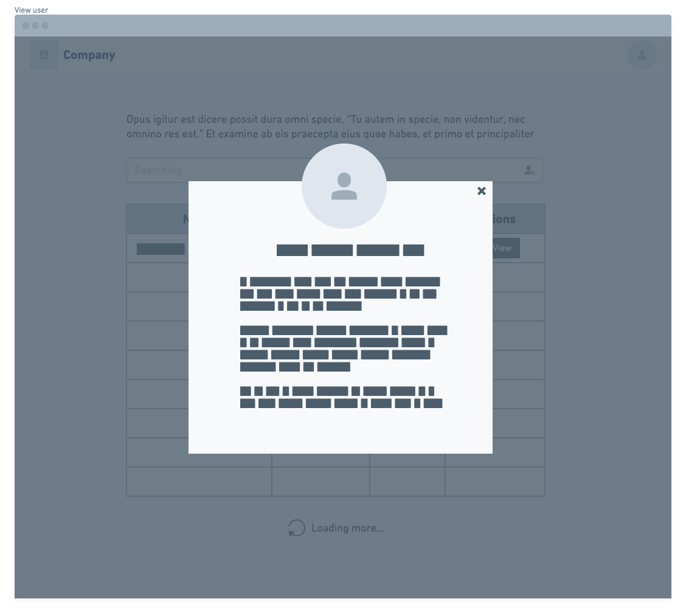

# Front-End Challenge 🏅 2021 Coodesh - Pharma Inc.

## Introdução

Desafio da Coodesh para teste de conhecimento em desenvolvimento front-end. O projeto consiste em um dashbord com lista de pacientes, um buscador por nome e botão de ordenação por nome e gênero, além de visualização expandida dos dados dos pacientes.




## Linguagens e Tecnologias

Este projeto foi realizado utilizando React, Typescript e Styled Components.

## Especificações

- Listagem de usuários buscando dados da random user API
- 50 usuários por request
- Parâmetro de paginação para botão "carregar mais"
- Visualizar expandida dos dados dos pacientes.
- Filtro por ordem alfabética e gênero
- Buscador por nome de usuário

## Como rodar o projeto

```
git clone https://github.com/holymos/coodesh-challenge-pharma-inc
```

```
cd coodesh-challenge-pharma-inc
```

```
npm i || yarn
```

```
npm start || yarn start
```
